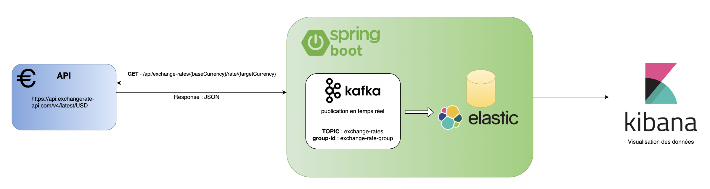
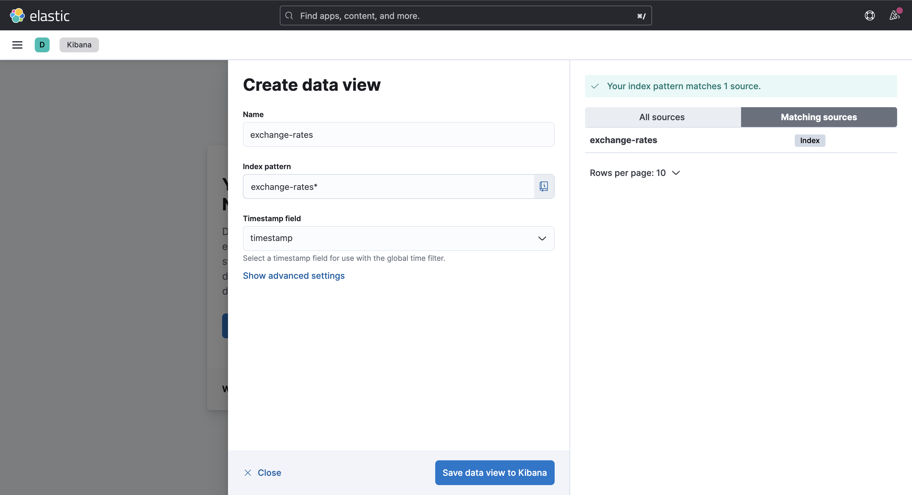
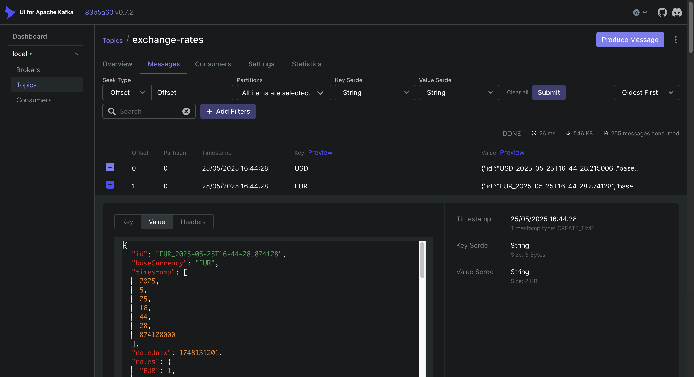
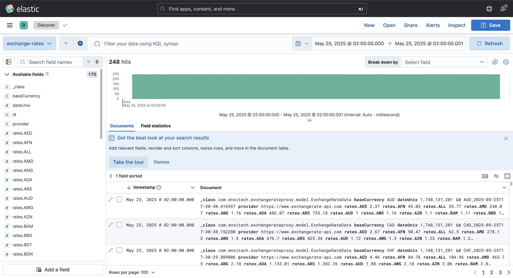

# Exchange Rate Proxy - Projet Spring Boot avec Kafka et ELK


## Description du Projet

Cette application sert de proxy centralisé pour les taux de change, permettant de :
- Récupérer les taux de change depuis une API externe (https://api.exchangerate-api.com/v4/latest/USD)
- Les taux de change sont récupérées toutes les minutes
- Publier les données en temps réel sur Kafka
- Stocker les données dans Elasticsearch
- Visualiser les données via Kibana
- Fournir une API REST pour les équipes internes

## Architecture



## Technologies Utilisées

- **Spring Boot 3.5.0** avec Spring Web, Kafka, et Elasticsearch
- **Apache Kafka** pour le streaming des données
- **Elasticsearch** pour le stockage et l'indexation
- **Kibana** pour la visualisation
- **Lombok** pour réduire le code boilerplate
- **Docker & Docker Compose** pour l'infrastructure

## Structure du Projet

```
src/main/java/com/exchangerate/
├── ExchangeRateProxyApplication.java    # Classe principale
├── config/
│   └── ApplicationConfiguration.java    # Configuration
├── controller/
│   └── ExchangeRateController.java     # API REST
├── kafka/
│   └── ExchangeRateKafkaConsumer.java  # Consommateur Kafka
├── model/
│   ├── ExchangeRateData.java           # Modèle principal
│   └── ExternalApiResponse.java        # Modèle API externe
├── scheduler/
│   └── ScheduledTasks.java             # Tâches programmées
└── service/
    ├── ExchangeRateService.java        # Service principal
    └── ElasticsearchService.java       # Service Elasticsearch
```

## 🛠️ Installation et Démarrage

### Prérequis
- Java 17+
- Maven 3.6+
- Docker et Docker Compose

### 1. Cloner le projet
```bash
git clone <url-du-projet>
cd exchange-rate-proxy
```

### 2. Démarrer l'infrastructure
```bash
# Démarrer Kafka, Elasticsearch et Kibana
docker-compose up -d

# Vérifier que tous les services sont démarrés
docker-compose ps
```

### 3. Compiler et démarrer l'application
```bash
# Compiler le projet
mvn clean compile

# Démarrer l'application avec Maven
mvn spring-boot:run

# ou à partir de ExchangeRateProxyApplication pour RUN le projet.
```

- Application Spring Boot : http://localhost:8080
- Kafka UI : http://localhost:8081
- Elasticsearch : http://localhost:9200
- Kibana : http://localhost:5601

## Endpoints API

### Récupérer les taux actuels
```bash
GET /api/exchange-rates/{baseCurrency}
# Exemple: GET /api/exchange-rates/USD
```

### Récupérer les derniers taux stockés
```bash
GET /api/exchange-rates/{baseCurrency}/latest
# Exemple: GET /api/exchange-rates/EUR/latest
```

### Récupérer un taux spécifique
```bash
GET /api/exchange-rates/{baseCurrency}/rate/{targetCurrency}
# Exemple: GET /api/exchange-rates/USD/rate/EUR
```

### Récupérer l'historique
```bash
GET /api/exchange-rates/{baseCurrency}/history?from=2024-01-01T00:00:00&to=2024-01-31T23:59:59
```

### Forcer une mise à jour
```bash
POST /api/exchange-rates/{baseCurrency}/refresh
```

### Statut de santé
```bash
GET /api/exchange-rates/health
```

## Configuration Kibana

### 1. Créer un Index Pattern
1. Ouvrir Kibana : http://localhost:5601
2. Aller dans **Stack Management** > **Create Data View**
3. Créer un index pattern : `exchange-rates*`
4. Choisir `timestamp` comme champ de temps




## Configuration

### Variables d'environnement principales
```yaml
# application.yml
exchange-rate:
  api:
    url: https://api.exchangerate-api.com/v4/latest
    default-base-currency: USD
  kafka:
    topic: exchange-rates
  scheduler:
    fixed-rate: 60000  # 1 minute
```

### Configuration Kafka
- **Topic** : `exchange-rates`
- **Partitions** : 3
- **Réplication** : 1

### Visualisation avec Kafka UI


```json
{
	"id": "EUR_2025-05-25T16-44-28.874128",
	"baseCurrency": "EUR",
	"timestamp": [
		2025,
		5,
		25,
		16,
		44,
		28,
		874128000
	],
	"dateUnix": 1748131201,
	"rates": {
		"EUR": 1,
		"AED": 4.17,
		"AFN": 79.19,
		"ALL": 98.07,
		"AMD": 435.91,
		"ANG": 2.03,
		"AOA": 1056.66,
		"ARS": 1289.81,
		"AUD": 1.75,
      ....
		"ZMW": 31.02,
		"ZWL": 30.45
	},
	"source": "API",
	"provider": "https://www.exchangerate-api.com"
}
```
Consultation du JSON publié sur Kafka puis stocké dans ElasticSearch à 16h44 le 25 mai 2025 de la devise de EUR.
Nous pouvons observer que **1 EUR = 4.17 AED**.

### Configuration Elasticsearch
- **Index** : `exchange-rates`
- **Type de document** : `ExchangeRateData`


## Monitoring et Observabilité

### Endpoints Actuator
- Health : http://localhost:8080/actuator/health
- Metrics : http://localhost:8080/actuator/metrics
- Info : http://localhost:8080/actuator/info

### Logs
Les logs sont configurés avec différents niveaux :
- `DEBUG` pour le package `com.ensitech.exchangerateproxy`
- `INFO` pour Kafka et Elasticsearch

## Consommation

### Consommer depuis Kafka
```java
@KafkaListener(topics = "exchange-rates")
public void handleExchangeRate(ExchangeRateData data) {
    // Traiter les données en temps réel
}
```

### Utiliser l'API REST avec RestTemplate
```java
// Client REST pour récupérer les taux
RestTemplate restTemplate = new RestTemplate();
ExchangeRateData rates = restTemplate.getForObject(
    "http://proxy-host:8080/api/exchange-rates/USD", 
    ExchangeRateData.class
);
```

## Statut et Métriques

L'application expose des métriques via Actuator pour :
- Nombre d'appels à l'API externe
- Latence des requêtes
- Nombre de messages Kafka publiés
- Statut d'Elasticsearch